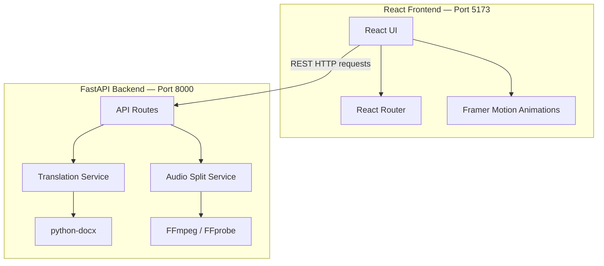

# Teacher Utilities

An utility application for educators and researchers, providing tools for document translation and audio processing. This project is basically for my Dad lol :v

---

## 📁 Folder Structure

```
.
├── backend/                  # FastAPI backend
│   ├── api/                  # API routes and logic
│   ├── core/                 # Core configurations
│   ├── services/             # Translation & Transcription logic
│   └── requirements.txt      # Python dependencies
├── frontend/                 # React + Vite frontend
│   ├── src/                  # React components & logic
│   ├── package.json          # Node.js dependencies
│   └── requirements.txt      # Dependency list (as requested)
├── vercel.json               # Deployment configuration for Vercel
└── README.md
```

---

## 🏗️ System Architecture



### Components Summary

| Layer                | Technology                    | Role                                              |
| -------------------- | ----------------------------- | ------------------------------------------------- |
| **Frontend**   | React + Vite + Tailwind CSS   | Premium UI/UX with glassmorphism and animations   |
| **Backend**    | FastAPI                       | High-performance REST API                         |
| **Services**   | python-docx + deep-translator | Document translation with formatting preservation |
| **Audio**      | FFmpeg / Pydub                | High-speed audio splitting for transcription      |
| **Deployment** | Vercel                        | Full-stack deployment (Preview & Production)      |

---

## 🚀 Getting Started

### 1. Set Up the Backend

Navigate to the backend directory and install dependencies:

```bash
cd backend
pip install -r requirements.txt
```

Run the FastAPI server:

```bash
python main.py
```

The API will be available at `http://localhost:8000`. Access interactive documentation at `http://localhost:8000/docs`.

### 2. Set Up the Frontend

Navigate to the frontend directory and install dependencies:

```bash
cd frontend
npm install
```

Run the Vite development server:

```bash
npm run dev
```

The app will be available at `http://localhost:5173`.

### 3. Deployment on Vercel

Simply connect your repository to Vercel. The `vercel.json` file at the root will automatically configure the build settings for both the Python backend and the React frontend.

---

## 🧪 Testing

To test the backend services:

```bash
cd backend
python -m pytest
```

---

## 📋 Prerequisites

| Requirement              | Version | Notes                                                |
| ------------------------ | ------- | ---------------------------------------------------- |
| **Python**         | 3.10+   | Required for backend                                 |
| **Node.js + npm**  | v18+    | Required for frontend                                |
| **FFmpeg**         | Latest  | Must be installed in system PATH for audio splitting |
| **Microsoft Word** | -       | Required on Windows for .doc to .docx conversion     |
